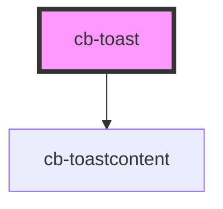

# cb-toast

<!-- Auto Generated Below -->

## Methods

### `Toast(toast: any) => Promise<void>`

#### Returns

Type: `Promise<void>`

## Dependencies

### Depends on

- [cb-toastcontent](../cb-toastcontent)

### Graph

----------------------------------------------

*Built with [StencilJS](https://stenciljs.com/)*
