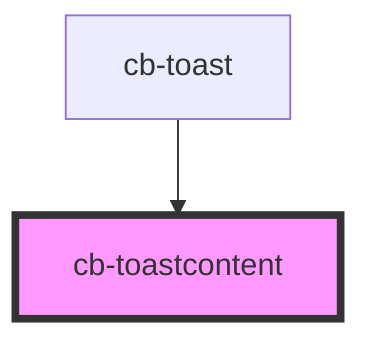

# cb-toastcontent

<!-- Auto Generated Below -->

## Methods

### `setParams(toast: any) => Promise<void>`

#### Returns

Type: `Promise<void>`

## Dependencies

### Used by

 - [cb-toast](../cb-toast)

### Graph

----------------------------------------------

*Built with [StencilJS](https://stenciljs.com/)*
